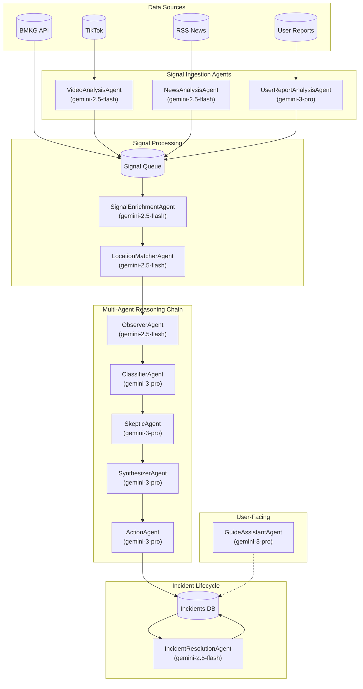
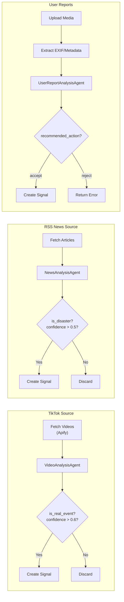
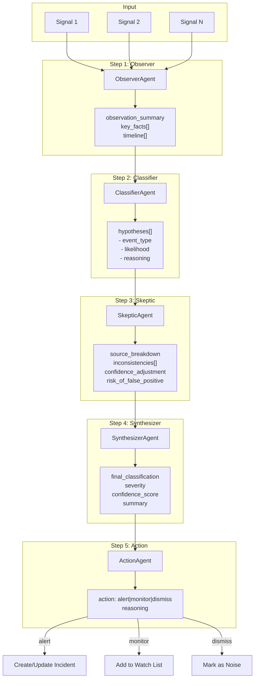

# Disaster Pulse


Demo Video: https://www.youtube.com/watch?v=HHG5lG-VgXg

Indonesia is one of the most disaster-prone countries in the world, experiencing earthquakes, tsunamis, volcanic eruptions, and floods regularly. Yet, critical information often reaches citizens too late—through fragmented news reports or word of mouth. We were inspired by the gap between when disasters happen and when people actually know about them. What if AI could bridge this gap by continuously monitoring multiple data sources and alerting communities in real-time?

**Disaster Pulse** is a real-time disaster monitoring and intelligence platform for Indonesia. It aggregates data from multiple sources:
- **BMKG (Official Earthquake/Tsunami data)**
- **TikTok videos** for ground-truth social signals
- **News RSS feeds** for media coverage
- **User Reports** for crowd-sourced reports & verification

The platform uses a **Multi-Agent AI System** powered by Gemini to analyze, verify, and cluster incoming signals. Each signal passes through 5 specialized AI agents (Observer → Classifier → Skeptic → Synthesizer → Action) that work together to:
1. Detect potential disasters from raw data
2. Classify severity and type
3. Challenge potential false positives
4. Synthesize multiple sources into coherent incidents
5. Decide on actions (create alert, merge with existing incident, or discard)

Users see a real-time map with active incidents, receive push notifications for their saved locations, and can contribute their own reports and verifications—creating a human-in-the-loop system that combines AI speed with community trust.

## How we built it

- **Frontend**: Next.js with React 19, Tailwind CSS, Leaflet maps, and PWA support for offline capability
- **Backend**: NestJS with event-driven architecture, BullMQ queues for background processing
- **AI Layer**: **Google Gemini Multimodal API** powering 11 specialized agents—most notably the **VideoAnalysisAgent** that processes TikTok video content directly using Gemini's native vision capabilities, and SignalEnrichmentAgent for geocoding and data enhancement
- **Database**: PostgreSQL with PostGIS for geospatial queries
- **Auth & Real-time**: Supabase for authentication and real-time subscriptions
- **Notifications**: Firebase Cloud Messaging for push notifications
- **Architecture**: Turborepo monorepo with shared TypeScript types

## Challenges we ran into

1. **AI Cost Optimization**: Running 5 sequential LLM calls per signal was expensive. We implemented signal pooling, batch processing, and a reasoning cache to reduce API calls by ~60%.

2. **False Positive Management**: Social media signals are noisy. We built a SkepticAgent that specifically challenges potential false positives and requires multiple source corroboration.

3. **Real-time Performance**: Balancing instant notifications with accurate verification required careful tuning of our event-driven pipeline and batching strategies.

4. **Video Analysis**: Leveraging **Gemini's multimodal capabilities** to process TikTok videos directly—the model analyzes video frames to detect disaster-related content like flooding, structural damage, or emergency situations without needing separate frame extraction pipelines.

## Accomplishments that we're proud of

- **Hybrid Intelligence**: Our 5-agent reasoning chain provides transparency—users can see exactly *why* the AI classified something as a disaster
- **Community Verification Loop**: The verification system lets users confirm or dispute AI findings, building community trust
- **Sub-minute Alert Delivery**: From signal detection to user notification in under 60 seconds for urgent events
- **Polished PWA**: Fully offline-capable, installable mobile app with push notifications

## What we learned

- **Gemini's multimodal power is a game-changer**: Processing video content directly with Gemini eliminated complex frame extraction pipelines and produced superior disaster detection results
- **Gemini excels at structured reasoning**: The multi-agent approach with Gemini produced more reliable results than single-prompt approaches
- **Human-in-the-loop is essential**: AI alone isn't enough—community verification dramatically improved accuracy
- **Batch processing is key**: Pooling signals before AI evaluation significantly reduced costs without sacrificing speed for critical events

## What's next for Disaster Pulse

1. **Expand data sources**: Integrate Twitter/X, Instagram, and local government APIs
2. **Predictive capabilities**: Use historical data to predict disaster-prone times and areas
3. **Government partnerships**: Work with BNPB (Indonesia's disaster agency) for official integration

## System Architecture

The project is a monorepo managed with **Turborepo** and **npm**, consisting of:

| Package | Description | Tech Stack |
|---------|-------------|------------|
| `apps/web` | Next.js PWA frontend | Next.js, Tailwind CSS 4, Leaflet, TanStack Query |
| `apps/api` | NestJS backend service | NestJS, PostgreSQL + PostGIS, BullMQ, Gemini AI |
| `packages/shared` | Shared types and utilities | TypeScript |

---

## Key Features

### Frontend (Web)

- **Real-time Map**: Leaflet-based map with custom clustering and live incident tracking
- **PWA Support**: Fully offline-capable, installable on mobile devices
- **Live Updates**: Real-time signals from backend via SSE
- **Responsive Design**: Mobile-first UI optimized for touch interfaces

### Backend (API)

- **Multi-Source Ingestion**:
  - **BMKG**: Earthquake and Tsunami official data
  - **RSS Feeds**: News aggregation and analysis
  - **TikTok**: Social media signal detection via Apify
  - **User Reports**: Crowd-sourced ground truth with media upload
- **AI Analysis**: Multi-agent LLM-based verification and clustering
- **Event-Driven**: Automated incident lifecycle management

---

## AI Agents Architecture

### Overview



### Signal Ingestion Flow



### Multi-Agent Reasoning Chain

When an incident needs full evaluation, signals go through a debate-style reasoning chain:



### Agent Reference

| Agent | Model | Type | Role & Logic |
|-------|-------|------|--------------|
| **SignalEnrichmentAgent** | `gemini-2.5-flash` | Ingestion | **Triage & Geocoding**. Process raw signals in batches. <br>• Infers `{City}, {Province}` from unstructured text.<br>• Rejects signals outside Indonesia.<br>• Assigns initial severity score. |
| **VideoAnalysisAgent** | `gemini-2.5-flash` | Ingestion | **TikTok Analyst**. Analyzes video content + captions.<br>• Multimodal check: Does visual match text?<br>• Freshness check: Is this old footage being reposted?<br>• Location check: Must be in Indonesia. |
| **NewsAnalysisAgent** | `gemini-2.5-flash` | Ingestion | **News Analyst**. Filters RSS feeds.<br>• Distinguishes active disasters from prevention articles/history.<br>• Extracts specific location and time.<br>• Rejects international news. |
| **UserReportAnalysisAgent** | `gemini-3-pro` | Ingestion | **Forensic Analyst**. Validates user submissions.<br>• Checks EXIF metadata consistency (GPS/Time).<br>• Detects "fake" or "spam" reports.<br>• Multimodal analysis of user upload media. |
| **ObserverAgent** | `gemini-2.5-flash` | Reasoning | **The Eye**. Step 1 of Reasoning Chain.<br>• Reads raw signals (text/images).<br>• Extracts objective facts only (timeline, casualty counts).<br>• No speculation allowed. |
| **ClassifierAgent** | `gemini-3-pro` | Reasoning | **The Theorist**. Step 2 of Reasoning Chain.<br>• Proposes multiple hypotheses based on facts (e.g., "Flood" vs "Puddle").<br>• Assigns likelihood scores.<br>• Restricted to Indonesian event types. |
| **SkepticAgent** | `gemini-3-pro` | Reasoning | **The Critic**. Step 3 of Reasoning Chain.<br>• Challenges hypotheses.<br>• Checks source diversity (Bio-verification).<br>• Penalizes single-source or viral-only reports.<br>• Explicitly demotes out-of-region events. |
| **SynthesizerAgent** | `gemini-3-pro` | Reasoning | **The Judge**. Step 4 of Reasoning Chain.<br>• Weighs hypotheses vs critiques.<br>• Produces final classification and confidence score.<br>• Generates user-facing summaries. |
| **ActionAgent** | `gemini-3-pro` | Reasoning | **The Strategist**. Step 5 of Reasoning Chain.<br>• Decides system action based on confidence threshold (0.6).<br>• `CREATE_INCIDENT`: High confidence, new event.<br>• `MERGE_INCIDENT`: Matches existing active incident.<br>• `WAIT`: Insufficient data.<br>• `DISMISS`: Benign/Noise. |
| **LocationMatcherAgent** | `gemini-2.5-flash` | Utility | **Fuzzy Geospatial Matcher**.<br>• Compares two location strings (e.g. "Jaksel" vs "Jakarta Selatan").<br>• Determines if they refer to the same incident cluster. |
| **IncidentResolutionAgent** | `gemini-2.5-flash` | Utility | **Cleanup Crew**.<br>• Analyzes stale incidents (no updates > 6h).<br>• Determines if safe to resolve/close. |
| **GuideAssistantAgent** | `gemini-3-pro` | Utility | **Safety Guide**.<br>• RAG-based safety advice.<br>• Context-aware answers based on active incident. |

---

## Getting Started

### Prerequisites

- Node.js 20+
- npm
- PostgreSQL with PostGIS (via Supabase)
- Redis (for BullMQ queues)

### Installation

1. **Clone and Install Dependencies**
   ```bash
   git clone https://github.com/your-org/disaster-pulse.git
   cd disaster-pulse
   npm install
   ```

2. **Configure Environment Variables**
   ```bash
   # Copy example files
   cp apps/api/.env.example apps/api/.env
   cp apps/web/.env.example apps/web/.env.local

   # Edit with your credentials
   ```

3. **Start Development Servers**
   ```bash
   npm run dev
   ```

4. **Build for Production**
   ```bash
   npm run build
   ```

---

## Environment Variables

### API (`apps/api/.env`)

```env
# Server
PORT=3001

# Database (Supabase)
SUPABASE_URL=https://your-project.supabase.co
SUPABASE_SERVICE_ROLE_KEY=your-service-role-key

# AI / LLM (Gemini)
GEMINI_API_KEY=your-gemini-api-key
GEMINI_BASE_URL=https://api.maiarouter.ai/v1
GEMINI_FLASH_MODEL=maia/gemini-2.5-flash
GEMINI_PRO_MODEL=maia/gemini-3-pro-preview

# Google Maps (Geocoding)
GOOGLE_MAPS_API_KEY=your-google-maps-api-key

# Cloudflare R2 (Media Storage)
R2_ACCOUNT_ID=your-r2-account-id
R2_ACCESS_KEY_ID=your-r2-access-key-id
R2_SECRET_ACCESS_KEY=your-r2-secret-access-key
R2_BUCKET_NAME=disaster-media
R2_PUBLIC_URL=https://media.yourdomain.com

# Firebase (Notifications & Remote Config)
FIREBASE_SERVICE_ACCOUNT_BASE64=base64-encoded-service-account-json
FIREBASE_PROJECT_ID=your-firebase-project-id

# Redis (BullMQ Queues)
REDIS_HOST=localhost
REDIS_PORT=6379
```

### Web (`apps/web/.env.local`)

```env
# API
NEXT_PUBLIC_API_URL=http://localhost:3001

# Supabase (Client-side)
NEXT_PUBLIC_SUPABASE_URL=https://your-project.supabase.co
NEXT_PUBLIC_SUPABASE_ANON_KEY=your-anon-key

# Firebase (Client-side)
NEXT_PUBLIC_FIREBASE_API_KEY=your-firebase-api-key
NEXT_PUBLIC_FIREBASE_AUTH_DOMAIN=your-project.firebaseapp.com
NEXT_PUBLIC_FIREBASE_PROJECT_ID=your-firebase-project-id
NEXT_PUBLIC_FIREBASE_STORAGE_BUCKET=your-project.appspot.com
NEXT_PUBLIC_FIREBASE_MESSAGING_SENDER_ID=your-messaging-sender-id
NEXT_PUBLIC_FIREBASE_APP_ID=your-firebase-app-id
NEXT_PUBLIC_FIREBASE_VAPID_KEY=your-vapid-key

# Feature Flags
NEXT_PUBLIC_FEATURE_USER_REPORTS=true

# Admin Access
ADMIN_EMAIL_WHITELIST=admin@example.com
```

---

## API Endpoints

### Core Resources
- **Incidents**
  - `GET /incidents/map` - Viewport clustering (bbox)
  - `GET /incidents/nearby` - Geospatial radius search
  - `GET /incidents/:id` - Full incident details
  - `GET /incidents/:id/signals` - Raw signals clustering to incident
  - `GET /incidents/:id/lifecycle` - Incident status history
- **Reports**
  - `POST /reports` - Submit user report (multipart w/ images/video)
  - `GET /reports/user/:userId` - History of user submissions
- **Guides**
  - `GET /guides` - Disaster safety guides (filterable)
  - `POST /guides/ask` - AI Safety Assistant (RAG-based Q&A)
- **Users**
  - `POST /users/sync` - Sync Supabase Auth profile
  - `POST /user/places` - Create monitored location
  - `PATCH /user/places/:id/notifications` - Toggle alerts for location

### Admin & Internal
- **Dashboard**
  - `GET /admin/stats` - System-wide metrics
  - `GET /admin/incidents` - Incident management table
  - `GET /admin/signals` - Raw signal inspector
  - `GET /admin/evaluations` - AI reasoning logs
- **Demo Tools**
  - `POST /admin/demo/seed` - Inject fake disaster scenarios
  - `POST /admin/demo/reset` - Wipes database

### System
- **Notifications**
  - `POST /notifications/subscribe` - Register FCM token
- **Emergency Contacts**
  - `GET /emergency-contacts` - Localized emergency numbers

---

## Key Modules

### Application Modules
| Module | Description |
|--------|-------------|
| `IncidentsModule` | Core logic for clustering and lifecycle management |
| `SignalsModule` | Raw data ingestion and normalization |
| `ReasoningModule` | Helper module for AI Agent orchestration |
| `ReportsModule` | User report handling and verification |
| `GuidesModule` | RAG-based safety guide system |
| `UsersModule` | User profile and preferences management |
| `UserPlacesModule` | Saved locations and geofencing logic |

### Infrastructure Modules
| Module | Description |
|--------|-------------|
| `DatabaseModule` | Supabase / PostgreSQL connection |
| `QueueModule` | BullMQ job processing configuration |
| `UploadModule` | Cloudflare R2 media storage |
| `NotificationsModule` | Firebase Cloud Messaging wrapper |
| `SseModule` | Server-Sent Events for real-time updates |

### Ingestion Source Modules
| Module | Description |
|--------|-------------|
| `BmkgModule` | Earthquake/Tsunami API poller |
| `TiktokModule` | Social media video scraper |
| `RssModule` | News feed aggregator |

---

## License

MIT
