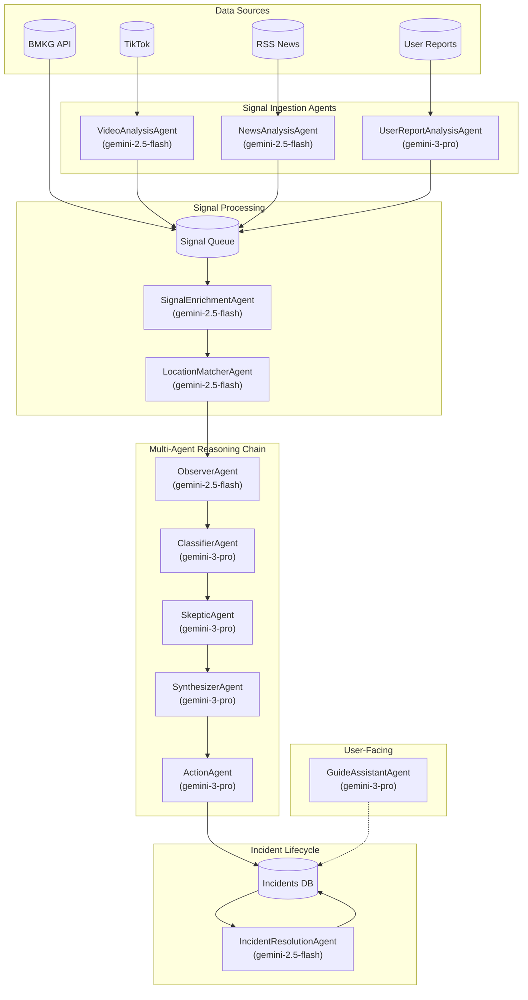
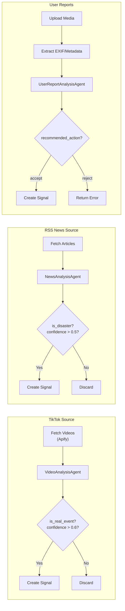
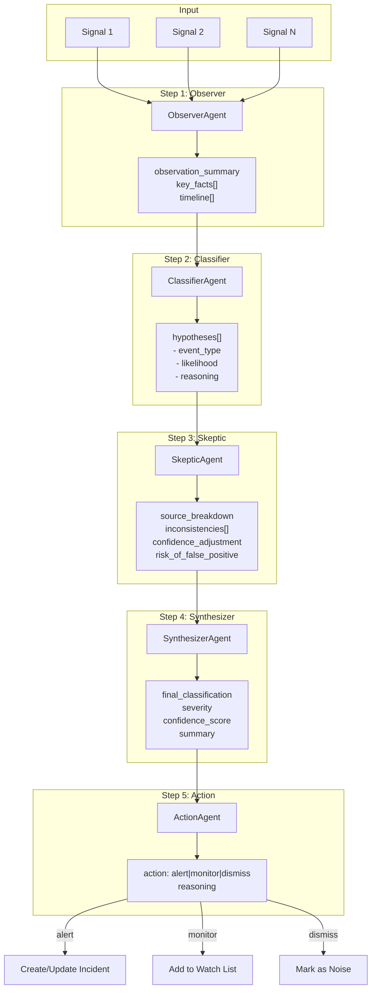
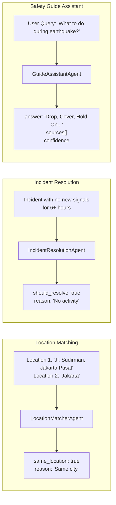
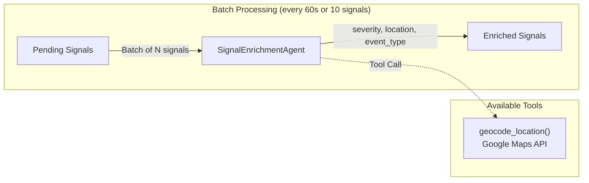

# Disaster Pulse - API Service

The backend service for Disaster Pulse, built with **NestJS**. This service handles data ingestion, AI analysis, clustering, and serves the REST API.

## Features

- **Event-Driven Architecture**: Uses `event-emitter` to decouple ingestion, analysis, and notification.
- **Multiple Data Sources**:
  - **BMKG**: Polling service for Earthquake/Tsunami.
  - **TikTok**: Scraper agent to find disaster-related content.
  - **RSS**: News aggregation from reputable sources.
  - **User Reports**: API for crowd-sourced entries with media upload.
- **Intelligent Reasoning**: Multi-agent LLM-based verification and analysis.
- **Clustering**: Spatiotemporal grouping of signals into incidents.

## Tech Stack

- **Framework**: NestJS
- **Language**: TypeScript
- **Database**: PostgreSQL + PostGIS (via Supabase)
- **AI**: Gemini 2.5 Flash & Gemini 3 Pro Preview (via MAIA Router)
- **Queues**: BullMQ
- **Storage**: Cloudflare R2

---

## AI Agents Architecture

### Overview



---

### 1. Signal Ingestion Flow

Each data source has a specialized agent for initial analysis:



#### VideoAnalysisAgent
- **Model**: `gemini-2.5-flash`
- **Input**: Video URL, caption, author, likes, timestamp
- **Output**: event_type, summary, location_inference, confidence_score, severity, is_real_event
- **Multimodal**: Analyzes video frames + text

#### NewsAnalysisAgent
- **Model**: `gemini-2.5-flash`
- **Input**: Article title, content, source, published date
- **Output**: event_type, summary, location, confidence_score, severity

#### UserReportAnalysisAgent
- **Model**: `gemini-3-pro-preview`
- **Input**: Description, event_type, media URL, user location, EXIF data
- **Output**: verified_event_type, authenticity assessment, recommended_action (accept/reject)
- **Features**: EXIF validation, location consistency check, multimodal analysis

---

### 2. Multi-Agent Reasoning Chain

When an incident needs full evaluation, signals go through a debate-style reasoning chain:



#### Agent Roles

| Agent | Model | Role |
|-------|-------|------|
| **ObserverAgent** | gemini-2.5-flash | Extract objective facts from raw signals |
| **ClassifierAgent** | gemini-3-pro | Generate multiple hypotheses with likelihood scores |
| **SkepticAgent** | gemini-3-pro | Challenge hypotheses, identify inconsistencies |
| **SynthesizerAgent** | gemini-3-pro | Produce final judgment from debate |
| **ActionAgent** | gemini-3-pro | Decide system action (alert/monitor/dismiss) |

---

### 3. Utility Agents



#### LocationMatcherAgent
- **Purpose**: Compare two location strings to determine if they refer to the same area
- **Use Case**: Prevent merging signals from different cities into one incident
- **Example**: "Jakarta Selatan" ≈ "South Jakarta" → `same_location: true`

#### IncidentResolutionAgent
- **Purpose**: Automatically resolve stale incidents
- **Trigger**: Cron job checks incidents with no new signals for 6+ hours
- **Output**: `should_resolve`, `resolution_reason`, `final_summary`

#### GuideAssistantAgent
- **Purpose**: Answer disaster safety questions
- **Input**: User query + incident context
- **Output**: Safety advice with sources and confidence

---

### 4. Signal Enrichment (Batch)



---

## Environment Variables

```env
# Database
SUPABASE_URL=https://xxx.supabase.co
SUPABASE_SERVICE_ROLE_KEY=xxx

# AI (MAIA Router)
MAIA_API_KEY=xxx

# Google Maps (for geocoding)
GOOGLE_MAPS_API_KEY=xxx

# Cloudflare R2 (media storage)
R2_ACCOUNT_ID=xxx
R2_ACCESS_KEY_ID=xxx
R2_SECRET_ACCESS_KEY=xxx
R2_BUCKET_NAME=disaster-media
R2_PUBLIC_URL=https://media.yourdomain.com

# Firebase (notifications)
FIREBASE_SERVICE_ACCOUNT_BASE64=xxx
FIREBASE_PROJECT_ID=xxx

# Redis (queues)
REDIS_HOST=localhost
REDIS_PORT=6379
```

---

## Key Modules

| Module | Description |
|--------|-------------|
| `SignalsModule` | Ingestion and raw data storage |
| `IncidentsModule` | Incident lifecycle management |
| `ReasoningModule` | AI Agent orchestration |
| `SourcesModule` | External data fetchers (TikTok, RSS, BMKG, Reports) |
| `UploadModule` | Cloudflare R2 file uploads |
| `NotificationsModule` | Firebase push notifications |
| `QueueModule` | BullMQ job processing |

---

## Development

1. **Install Dependencies**
   ```bash
   npm install
   ```

2. **Run Development Server**
   ```bash
   npm run dev
   ```

3. **Run Tests**
   ```bash
   npm test
   ```

---

## API Endpoints

### Reports
- `POST /reports` - Submit user report (multipart/form-data with media)
- `GET /reports/user/:userId` - Get user's reports

### Incidents
- `GET /incidents` - List all incidents
- `GET /incidents/:id` - Get incident details
- `GET /incidents/sse` - Server-Sent Events for real-time updates

### Guides
- `POST /guides/ask` - Ask safety question to GuideAssistantAgent

---

## License

MIT
