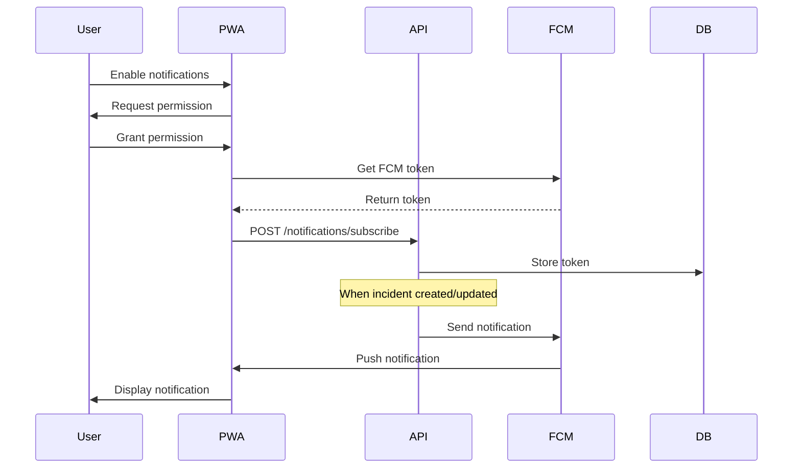

# PWA Push Notifications Implementation

## Summary

Implemented PWA push notifications using Firebase Cloud Messaging (FCM) with Supabase for the disaster-app. Users will receive real-time push notifications when new incidents are created or when incidents become high-severity alerts.

## Files Created

### Database
- [010_add_push_subscriptions.sql](file:///Users/denyherianto/Developer/Projects/disaster-app/apps/api/src/database/migrations/010_add_push_subscriptions.sql) - Migration for FCM token storage

### Frontend (`apps/web`)
- [firebase.ts](file:///Users/denyherianto/Developer/Projects/disaster-app/apps/web/src/lib/firebase.ts) - Firebase client configuration
- [firebase-messaging-sw.js](file:///Users/denyherianto/Developer/Projects/disaster-app/apps/web/public/firebase-messaging-sw.js) - Service worker for background notifications
- [usePushNotifications.ts](file:///Users/denyherianto/Developer/Projects/disaster-app/apps/web/src/hooks/usePushNotifications.ts) - React hook for subscription management

### Backend (`apps/api`)
- [notifications.module.ts](file:///Users/denyherianto/Developer/Projects/disaster-app/apps/api/src/notifications/notifications.module.ts)
- [notifications.service.ts](file:///Users/denyherianto/Developer/Projects/disaster-app/apps/api/src/notifications/notifications.service.ts) - FCM notification sending logic
- [notifications.controller.ts](file:///Users/denyherianto/Developer/Projects/disaster-app/apps/api/src/notifications/notifications.controller.ts) - REST endpoints

### Files Modified
- [app.module.ts](file:///Users/denyherianto/Developer/Projects/disaster-app/apps/api/src/app.module.ts) - Added NotificationsModule
- [incidents.module.ts](file:///Users/denyherianto/Developer/Projects/disaster-app/apps/api/src/incidents/incidents.module.ts) - Imported NotificationsModule
- [incidents.service.ts](file:///Users/denyherianto/Developer/Projects/disaster-app/apps/api/src/incidents/incidents.service.ts) - Added notification triggers
- [manifest.ts](file:///Users/denyherianto/Developer/Projects/disaster-app/apps/web/src/app/manifest.ts) - Added gcm_sender_id

---

## Required Configuration

> [!IMPORTANT]
> You need to complete these steps to enable push notifications.

### 1. Create Firebase Project
1. Go to [Firebase Console](https://console.firebase.google.com/)
2. Create a new project or use existing
3. Add a Web App to your project

### 2. Get Firebase Web Config
From Firebase Console → Project Settings → Your apps → Web app:
```
apiKey, authDomain, projectId, storageBucket, messagingSenderId, appId
```

### 3. Generate VAPID Key
Firebase Console → Project Settings → Cloud Messaging → Web Push certificates → Generate key pair

### 4. Get Service Account Key
Firebase Console → Project Settings → Service accounts → Generate new private key

### 5. Update Environment Variables

**Frontend** (`apps/web/.env.local`):
```bash
NEXT_PUBLIC_FIREBASE_API_KEY=your-api-key
NEXT_PUBLIC_FIREBASE_AUTH_DOMAIN=your-project.firebaseapp.com
NEXT_PUBLIC_FIREBASE_PROJECT_ID=your-project-id
NEXT_PUBLIC_FIREBASE_STORAGE_BUCKET=your-project.appspot.com
NEXT_PUBLIC_FIREBASE_MESSAGING_SENDER_ID=your-sender-id
NEXT_PUBLIC_FIREBASE_APP_ID=your-app-id
NEXT_PUBLIC_FIREBASE_VAPID_KEY=your-vapid-key
```

**Backend** (`apps/api/.env`):
```bash
# Base64 encode your service account JSON:
# cat service-account.json | base64
FIREBASE_SERVICE_ACCOUNT_BASE64=base64-encoded-string
```

### 6. Update Service Worker
Edit `apps/web/public/firebase-messaging-sw.js` and replace placeholder values with your Firebase config.

### 7. Run Database Migration
Execute `010_add_push_subscriptions.sql` in Supabase SQL Editor.

---

## Notification Flow



## Testing

1. **Enable notifications**: Call `usePushNotifications().subscribe()` from any component
2. **Create test incident**: The backend will automatically send push notifications
3. **Background test**: Close browser tab, wait for incident creation

---

## Verification

- ✅ TypeScript compilation passes (frontend & backend)
- ✅ Dependencies installed (`firebase`, `firebase-admin`)
- ✅ Notification triggers integrated into incident lifecycle
- ⏳ Firebase configuration (user action required)
- ⏳ Database migration (user action required)
